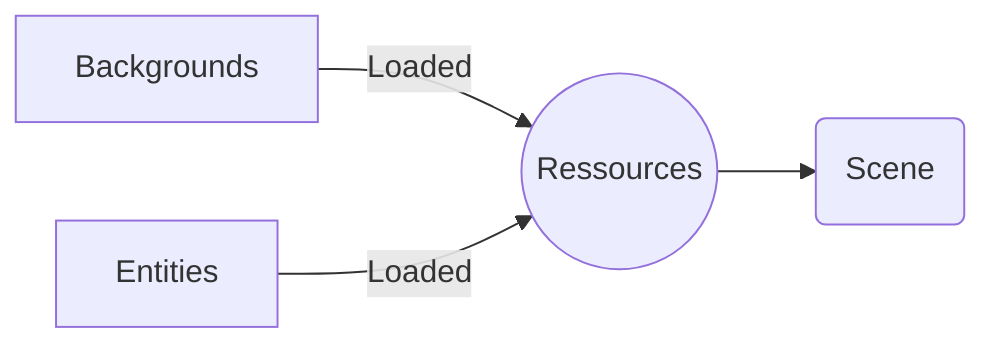

# Dream Weaver (Public)

## Premise
Dream Weaver aims to mix different renders and images to create a unique animated composition.

```mermaid
graph LR
A[Backgrounds] -- Loaded --> B((Ressources))
C[Entities] -- Loaded --> B((Ressources))
B --> D(Scene)
```

